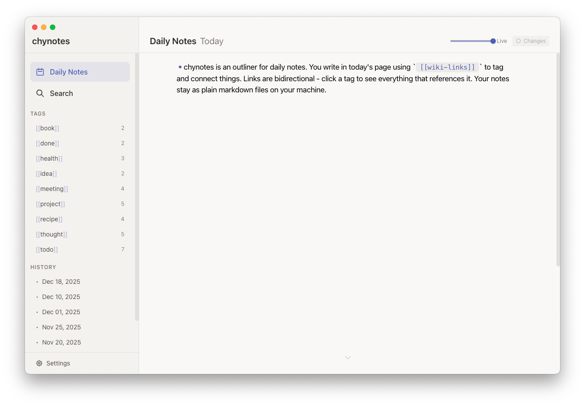
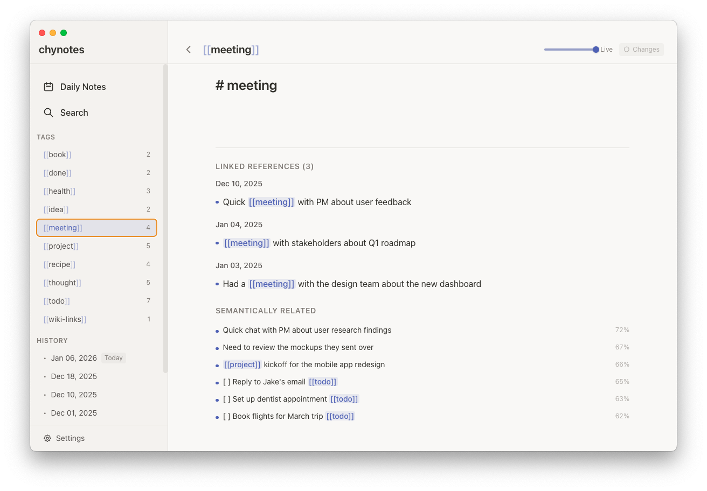
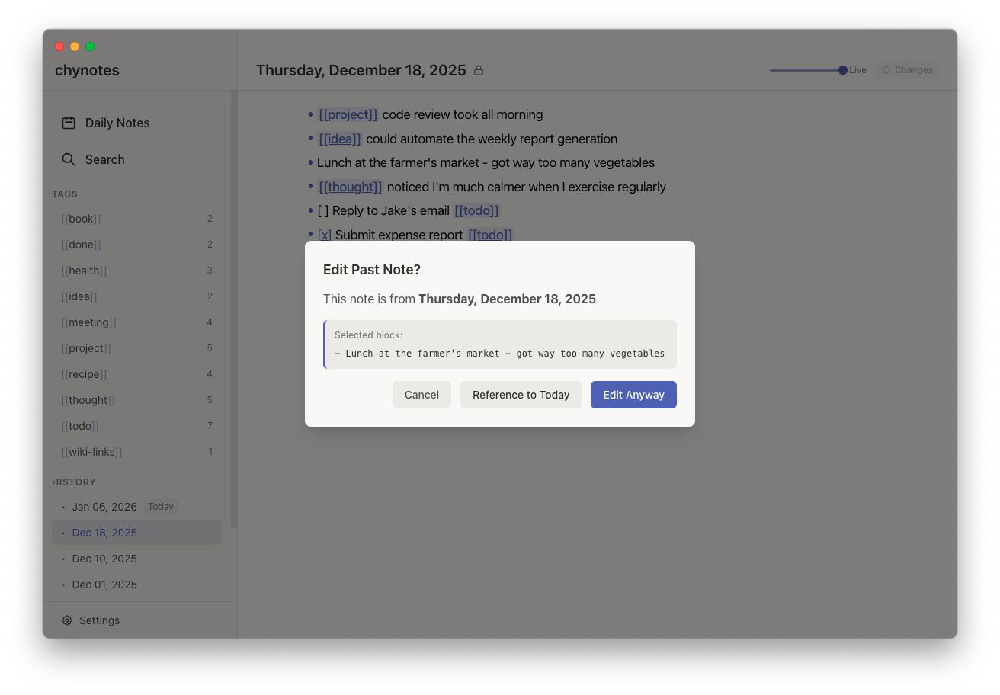
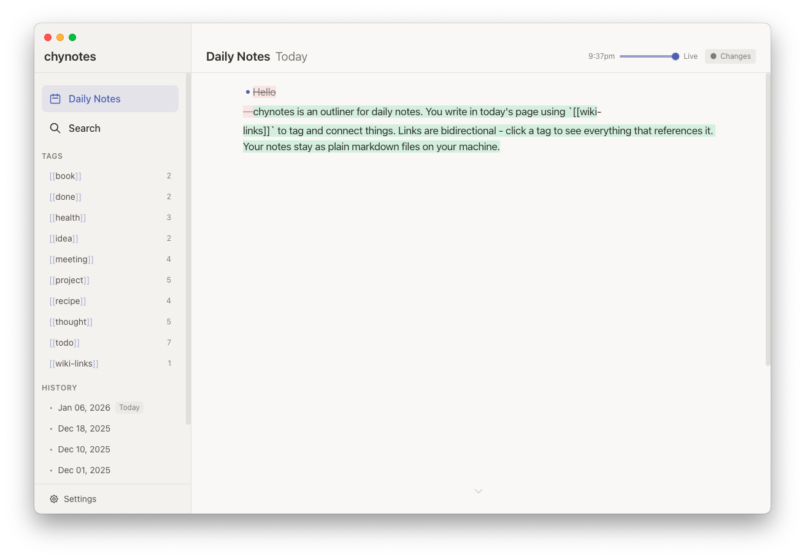

# chynotes

## What is chynotes?

chynotes is an outliner for daily notes. You write in today's page using `[[wiki-links]]` to tag and connect things. Links are bidirectional - click a tag to see everything that references it. Your notes stay as plain markdown files on your machine.



## Status

Chynotes is in alpha. Not recommended for daily use.

## Features

Your notes live as plain markdown files in `~/.chynotes/notes/`, one file per day. No database lock-in, no proprietary format. You can open them in any text editor.

Backlinks are semantic - the app uses embeddings to surface blocks that are related, not just ones that explicitly link. Tag pages are generated by a local LLM (Ollama) based on prompts you can edit.



Past notes are soft-locked. Yesterday is read-only by default; click to unlock if you need to edit. This encourages the use of the daily note, linked by tags.



A timeline scrubber lets you browse through your day's edits with word-level diffs.



Block references show context - embed a block and you see its parent and children, not just the line. Tooltips throughout the app use a lock-on-hover pattern inspired by Paradox strategy games.

Snapshots and indexes are stored in a SQLite file to keep your markdown folder clean. It's a single file, so you still own all your data.

## Running it

Requires [Ollama](https://ollama.com) running locally. Other local LLM providers and hosted services coming eventually.

```
git clone https://github.com/yuyangchee98/chynotes.git
cd chynotes
npm install
npm run electron:dev
```

## Why

LogSeq is moving to a database format. I wanted to keep plain markdown files.

I also wanted AI features baked in, and a flow that works better for me - soft-locked past notes and a timeline scrubber. Discarded ideas are still ideas; the scrubber lets you recover them without cluttering your notes.

## Direction

This will always be an outliner. Mobile is planned. AI features will expand - right now we have semantic backlinks via Ollama embeddings, with support for other embedding models coming. Tag pages may eventually support AI-generated React components via prompts, as a way to build custom views without Datalog queries.

## License

AGPL-3.0